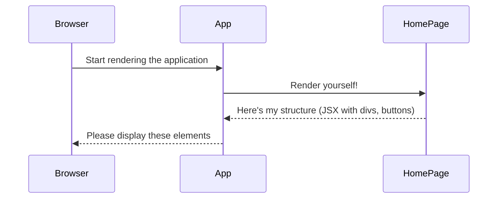

# Chapter 1: HomePage

Welcome to the Counter Game tutorial! We're going to build a fun little game where you click a button as fast as you can before the timer runs out.

Imagine you want to build something with LEGO bricks. You don't just start throwing bricks together randomly, right? You usually start with a baseplate and then add specific pieces onto it. In web development, especially with tools like React (which we're using), we build our user interfaces (UIs) in a similar way, using **components**.

Think of a component as a reusable building block for your UI. It could be a button, a text display, or even a whole section of your page.

**Our Goal:** We need to create the main screen for our Counter Game. This screen needs to show:
1.  A timer counting down.
2.  The current score (how many times you've clicked).
3.  A "start" button to begin the game.
4.  A "click me" button to increase the score.
5.  A "reset" button to clear everything.

How do we organize all these visual pieces and the logic that makes them work? We create a central component to hold everything!

## Meet the `HomePage` Component

In our project, this central component is called `HomePage`. It acts like the main "game board" for our Counter Game. It holds all the visual elements the player sees and interacts with.

**File:** `src/components/HomePage/HomePage.js`

Let's peek inside this file. Don't worry if it looks complicated at first; we'll break it down piece by piece throughout this tutorial. For now, focus on the overall structure.

```javascript
// src/components/HomePage/HomePage.js

import React, { useEffect, useState } from "react"; // Importing necessary tools from React
import "./HomePage.css"; // Importing styles to make it look nice

// This is our main component function
function HomePage() {
  // ... some logic will go here (we'll cover this later!)

  // This 'return' part describes what the component looks like
  return (
    <div className="home-container">
      {/* This shows the timer */}
      <div className="home-timer">timer:{/* some value */}</div>
      {/* This shows the score */}
      <div className="home-count">{/* some value */}</div>

      {/* This is the start button */}
      <button className="home-btn-start btn">
        start
      </button>
      {/* This is the button to click */}
      <button className="home-btn-click btn">
        click me
      </button>
      {/* This is the reset button */}
      <button className="home-btn-reset btn">
        reset
      </button>
    </div>
  );
}

export default HomePage; // Makes the component available for other files to use
```

**Explanation:**

1.  `import React...`: We bring in tools from the React library. Think of this like getting your LEGO box ready.
2.  `import "./HomePage.css";`: We link a separate file that contains styling rules (like colors, sizes, positioning) to make our component look good.
3.  `function HomePage() { ... }`: This is the core of our component. It's a JavaScript function. React runs this function to figure out what to show on the screen.
4.  `return ( ... );`: This is the crucial part for visuals. Whatever is inside the `return()` statement describes the structure of what you see on the page. It looks a lot like HTML! This special syntax is called **JSX**.
5.  `<div className="...">`, `<button className="...">`: These are JSX elements. They are like instructions telling the browser to create a container (`div`) or a button (`button`). The `className` part is used to apply styles from our CSS file.
6.  `export default HomePage;`: This line makes our `HomePage` component available so other parts of our application (like the main `App` component) can use it.

Right now, this component just describes the *layout*. The timer and count values aren't dynamic yet, and the buttons don't *do* anything when clicked. We'll add that functionality in the upcoming chapters!

## How is `HomePage` Used?

Our `HomePage` component doesn't appear on its own. It needs to be placed somewhere. In our project, the main application file, `App.js`, is responsible for rendering `HomePage`.

**File:** `src/App.js`

```javascript
import HomePage from "./components/HomePage/HomePage"; // Import our component

function App() {
  // Here, we tell React to render our HomePage component
  return <HomePage />;
}

export default App;
```

**Explanation:**

*   We `import` the `HomePage` component we just looked at.
*   Inside the `App` component's `return` statement, we use `<HomePage />`. This is like taking our `HomePage` building block and placing it inside the main `App` structure.

We'll learn more about the `App` component in [Chapter 5: Root Component (App)](05_root_component__app__.md).

## Under the Hood (Simplified)

When you run the application, here's a simplified sequence of what happens:

1.  The browser starts loading the application.
2.  The main entry point runs (we'll see this in [Chapter 6: Application Entry Point](06_application_entry_point_.md)).
3.  React renders the `App` component ([Chapter 5: Root Component (App)](05_root_component__app__.md)).
4.  The `App` component says, "Okay, I need to render the `HomePage` component."
5.  React runs the `HomePage` function.
6.  The `HomePage` function returns the JSX structure (the `div`s and `button`s).
7.  React takes this structure and tells the browser how to draw the timer display, count display, and buttons on the screen.

Here's a diagram illustrating this:



For now, the `HomePage` component primarily defines the *static* structure. The magic that makes the timer tick and the count update involves concepts we'll cover next:

*   Making buttons clickable: [Chapter 2: Event Handling (onClick)](02_event_handling__onclick__.md)
*   Remembering the count and timer values: [Chapter 3: State Management (useState)](03_state_management__usestate__.md)
*   Making the timer automatically count down: [Chapter 4: Side Effect Management (useEffect)](04_side_effect_management__useeffect__.md)

## Conclusion

Congratulations! You've learned about the fundamental building block of our game's interface: the `HomePage` component. You know that:

*   Components are like reusable UI building blocks (LEGOs!).
*   `HomePage` is the main component for our game screen, holding the timer, counter, and buttons.
*   It uses JSX (HTML-like syntax) inside its `return` statement to describe the visual structure.
*   It's rendered by the main `App` component.

Right now, our game looks like a board with pieces, but the pieces don't move yet. In the next chapter, we'll learn how to make things happen when we click the buttons!

Ready to make those buttons interactive? Let's dive into [Chapter 2: Event Handling (onClick)](02_event_handling__onclick__.md).

---

Generated by [AI Codebase Knowledge Builder](https://github.com/The-Pocket/Tutorial-Codebase-Knowledge)