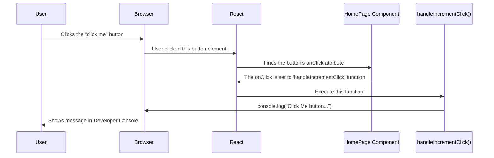

# Chapter 2: Event Handling (onClick)

Welcome back! In [Chapter 1: Game UI Component (HomePage)](01_game_ui_component__homepage__.md), we built the basic structure of our Counter Game screen using the `HomePage` component. We have buttons for "start", "click me", and "reset", but right now, they're just sitting there – clicking them does nothing!

Imagine you have a TV remote control. It has buttons, but if pressing the "Volume Up" button doesn't actually *do* anything, the remote isn't very useful. We need to connect the button press to an action. In web applications, this connection is made through **event handling**.

**Our Goal:** Make the buttons in our `HomePage` component actually respond when a user clicks them. For now, let's focus on making the "click me" button print a message to the console when clicked. This is the first step towards making it increase the score.

## Listening for Clicks: The `onClick` Event Handler

How do we tell our application, "Hey, when *this specific button* is clicked, please run *this specific piece of code*"? In React, we use special attributes called **event handlers**. For button clicks, the most common one is `onClick`.

Think of `onClick` as adding an ear to the button. This ear is constantly listening for a "click" sound. When it hears one, it triggers an action.

What action does it trigger? It runs a **function** that we provide. A function is just a reusable block of code that performs a specific task.

So, the process is:
1.  User clicks a button.
2.  The browser detects this click event.
3.  React sees that the button has an `onClick` attribute.
4.  React runs the function we assigned to `onClick`.

## Wiring Up a Button

Let's see how this looks in our `HomePage` component. We need to:
1.  Define a function that we want to run when the "click me" button is clicked.
2.  Attach this function to the button's `onClick` attribute.

**Step 1: Define the Function**

Inside our `HomePage` component function, let's define a simple JavaScript function. For now, this function will just use `console.log` to print a message. `console.log` is a handy tool for developers to see output and check if things are working – you can usually see this output in your browser's developer tools (often opened by pressing F12).

```javascript
// Inside the HomePage function, before the 'return' statement

function handleIncrementClick() {
  console.log("Click Me button was clicked!");
  // Later, this function will increase the score
}
```

*   We define a function named `handleIncrementClick`. The name clearly suggests what it's supposed to do (handle the click event for incrementing).
*   Inside the function, `console.log(...)` will print the message "Click Me button was clicked!" to the browser's developer console.

**Step 2: Attach the Function with `onClick`**

Now, we need to tell the "click me" button to use this function. We do this in the JSX part (inside the `return` statement) by adding the `onClick` attribute to the button element.

```javascript
// Inside the return (...) block of HomePage

// ... other elements ...

{/* This is the button to click */}
<button
  className="home-btn-click btn"
  onClick={handleIncrementClick} // <-- Attach the function here!
  // disabled={timer === 0} // We'll add 'disabled' logic later
>
  click me
</button>

// ... other elements ...
```

*   We add `onClick={handleIncrementClick}` to the `<button>`.
*   Notice the curly braces `{}` around `handleIncrementClick`. In JSX, curly braces are used to embed JavaScript expressions (like function names, variables, etc.) directly into the HTML-like structure.
*   We are **not** calling the function here (like `handleIncrementClick()`). We are passing the function itself, so React knows *which* function to call *later*, when the click happens.

**Putting it Together (Simplified `HomePage.js`)**

```javascript
// src/components/HomePage/HomePage.js
import React from "react"; // Removed useState/useEffect for simplicity now
import "./HomePage.css";

function HomePage() {
  // --- Our Event Handler Function ---
  function handleIncrementClick() {
    console.log("Click Me button was clicked!");
    // In the next chapter, we'll update the score here!
  }

  // --- Define other handlers (optional for now) ---
  function handleStartClick() {
    console.log("Start button clicked!");
  }

  function handleResetClick() {
    console.log("Reset button clicked!");
  }

  // --- JSX describing the UI ---
  return (
    <div className="home-container">
      {/* Displays (we'll make these dynamic later) */}
      <div className="home-timer">timer: 0</div>
      <div className="home-count">0</div>

      {/* Buttons with onClick handlers */}
      <button className="home-btn-start btn" onClick={handleStartClick}>
        start
      </button>
      <button className="home-btn-click btn" onClick={handleIncrementClick}>
        click me
      </button>
      <button className="home-btn-reset btn" onClick={handleResetClick}>
        reset
      </button>
    </div>
  );
}

export default HomePage;
```

Now, if you run the application and click the "click me" button, you won't see the counter change *on the screen* yet, but you *will* see the message "Click Me button was clicked!" appear in your browser's developer console each time you click it! We've successfully handled the click event.

## Under the Hood: How `onClick` Works

Let's visualize the simple flow when you click the button:



1.  **User Clicks:** You physically click the button on the screen.
2.  **Browser Detects:** The web browser knows a click happened on that specific HTML button element.
3.  **React Listens:** React has attached internal listeners (thanks to your `onClick`). It gets notified by the browser.
4.  **Find Handler:** React looks at the element that was clicked and sees the `onClick={handleIncrementClick}` prop.
5.  **Execute Function:** React calls the `handleIncrementClick` function that you defined within your `HomePage` component.
6.  **Function Runs:** Your function's code (`console.log(...)`) executes.

This mechanism allows us to connect user interactions directly to specific JavaScript logic within our components.

## Conclusion

Great job! You've learned the fundamental concept of event handling in React using `onClick`. You now know:

*   What `onClick` is: A special attribute to make elements react to clicks.
*   How to use it: Assign a JavaScript function to the `onClick` attribute in JSX (`onClick={myFunction}`).
*   What happens: Clicking the element triggers the assigned function.

We've successfully made our buttons *respond* to clicks by logging messages. However, our game isn't very interactive yet because clicking doesn't change what the user *sees* (like the score). We need a way for our component to *remember* information (like the current count) and update the display when that information changes.

That's exactly what we'll cover in the next chapter! Get ready to learn about managing component memory, or "state".

Ready to make that counter actually count? Let's move on to [Chapter 3: State Management (useState)](03_state_management__usestate__.md).

---

Generated by [AI Codebase Knowledge Builder](https://github.com/The-Pocket/Tutorial-Codebase-Knowledge)