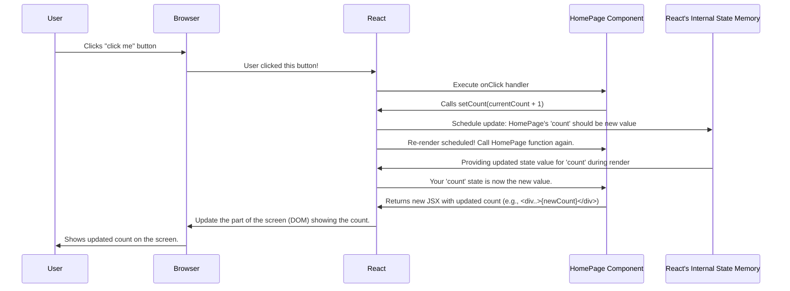

# Chapter 3: State Management (useState)

Welcome back! In [Chapter 2: Event Handling (onClick)](02_event_handling__onclick__.md), we learned how to make our buttons respond when clicked, using `onClick` to run functions like `handleIncrementClick`. However, clicking the "click me" button still doesn't change the score displayed on the screen. Why not?

Because our component currently has no memory! It doesn't *remember* what the current score is between clicks or renders. Every time React updates the screen, our `HomePage` function runs again, and any regular variables would be reset.

We need a way for our component to:
1.  **Remember** information (like the current score or the timer's remaining seconds).
2.  **Update** the screen automatically whenever this information changes.

This concept of remembering and managing data that affects the UI is called **State Management**.

**Our Goal:** Make the counter display update when the "click me" button is clicked, and make the timer display update when the "start" or "reset" buttons are clicked.

## Introducing `useState`: React's Memory

React gives us a special tool called a **Hook** to handle state. The main hook for managing state is `useState`.

Think of `useState` like getting a small, magic whiteboard for your component.
*   You can write an initial value on it (e.g., the starting score is `0`).
*   You get a way to read the current value written on the whiteboard.
*   You get a special eraser/marker tool that lets you *update* the value on the whiteboard.
*   **Crucially:** Whenever you use the special tool to update the whiteboard, React automatically takes a snapshot and updates the part of the screen that shows that value.

`useState` provides the "whiteboard" (the state variable) and the "special eraser/marker" (the function to update the state).

## How to Use `useState`

Let's add some state to our `HomePage` component to remember the `count`.

**Step 1: Import `useState`**

First, you need to tell your component file that you want to use this `useState` tool. You import it from the React library at the top of your file.

```javascript
// src/components/HomePage/HomePage.js
import React, { useState } from "react"; // <-- Import useState
import "./HomePage.css";
```

*   We add `useState` inside the curly braces `{}` because it's a "named import" from the `react` package.

**Step 2: Declare State Variable**

Inside your component function (e.g., `HomePage`), *before* the `return` statement, you call `useState()` to create a piece of state.

```javascript
// Inside the HomePage function
function HomePage() {
  // Declare a state variable called 'count', initialized to 0
  const [count, setCount] = useState(0);
  // ... other code ...
```

Let's break down this line: `const [count, setCount] = useState(0);`

*   `useState(0)`: We call the `useState` hook. The value inside the parentheses (`0`) is the **initial value** for this piece of state. So, our counter will start at 0.
*   `useState` returns an array containing exactly two things:
    1.  The current value of the state (initially `0`).
    2.  A special function to update that value.
*   `const [count, setCount] = ...`: We use a JavaScript feature called "Array Destructuring" to get these two things out of the array and give them names.
    *   `count`: This variable will always hold the *current* value of our counter state. We'll use this to display the score.
    *   `setCount`: This is the special function we *must* use to update the `count`. By convention, it's often named `set` followed by the state variable name (e.g., `setCount`, `setName`, `setIsLoading`).

**Step 3: Display the State Variable**

Now that we have the `count` variable holding our score, we can display it in our JSX. Remember, we use curly braces `{}` to embed JavaScript expressions (like our `count` variable) into JSX.

```javascript
// Inside the return (...) block of HomePage
  // ...
  {/* This shows the score */}
  <div className="home-count">{count}</div> {/* Use the count state variable */}
  // ...
```

*   Instead of a hardcoded number, we now use `{count}`. React will replace this with the current value of the `count` state variable whenever the component renders.

**Step 4: Update the State Using the Setter Function**

We need to update the count when the "click me" button is pressed. We do this inside the `handleIncrementClick` function (or directly in the `onClick` for simple cases) by calling the `setCount` function.

```javascript
// Update the onClick handler for the "click me" button
<button
  className="home-btn-click btn"
  onClick={() => setCount(count + 1)} // Call setCount to update the state!
  // disabled={timer === 0} // We'll handle 'disabled' later
>
  click me
</button>
```

*   `onClick={() => setCount(count + 1)}`: When the button is clicked, this inline arrow function is executed.
*   `setCount(count + 1)`: Inside the function, we call `setCount`. We pass the *new* value we want for the count. Here, we calculate it by taking the *current* `count` and adding 1.

**Why does this work?**

When you call `setCount(newValue)`, you're telling React: "Hey, the `count` state needs to change to `newValue`. Please re-render the `HomePage` component with this new value and update the screen accordingly."

React then does the following:
1.  Schedules an update for the `HomePage` component.
2.  Re-runs the `HomePage` function.
3.  When `useState(0)` is encountered this time, React remembers the *latest* value you set (e.g., `1`) and gives that back as `count`.
4.  The JSX is generated again, now with `<div className="home-count">{1}</div>`.
5.  React compares the new JSX with what's currently on the screen and efficiently updates only the changed part (the text inside the `div`).

This process ensures that your UI always stays synchronised with your component's state.

## Adding State for the Timer

We can repeat the same process for the timer:

```javascript
// src/components/HomePage/HomePage.js
import React, { useState } from "react"; // useEffect removed for now
import "./HomePage.css";

function HomePage() {
  // State for the count
  const [count, setCount] = useState(0);
  // State for the timer, starts at 0
  const [timer, setTimer] = useState(0);

  // Handle Start: Set timer to 10 seconds, reset count
  function handleStartClick() {
    setTimer(10);
    setCount(0); // Also reset count when starting
  }

  // Handle Click: Increment count (only if timer is running - logic added later)
  function handleIncrementClick() {
     // We only want this to work when timer > 0, but for now, just increment
     setCount(count + 1);
  }

  // Handle Reset: Reset count and timer to 0
  function handleResetClick() {
    setCount(0);
    setTimer(0);
  }

  return (
    <div className="home-container">
      {/* Display the timer state */}
      <div className="home-timer">timer:{timer}</div>
      {/* Display the count state */}
      <div className="home-count">{count}</div>

      {/* Buttons using handlers that call setter functions */}
      <button
        className="home-btn-start btn"
        onClick={handleStartClick}
        // disabled={timer !== 0} // Logic will be added
      >
        start
      </button>
      <button
        className="home-btn-click btn"
        onClick={handleIncrementClick}
        // disabled={timer === 0} // Logic will be added
      >
        click me
      </button>
      <button
        className="home-btn-reset btn"
        onClick={handleResetClick}
      >
        reset
      </button>
    </div>
  );
}

export default HomePage;
```

Now, clicking "start" will set the displayed timer to 10 (and reset the count). Clicking "reset" will set both back to 0. Clicking "click me" will increment the displayed count!

## Under the Hood: React's Memory

How does React remember the state (`count` and `timer`) between renders? It doesn't happen inside the `HomePage` function itself. React maintains a memory slot associated with the `HomePage` component *instance* on the screen.

Here's a simplified flow when you click the "click me" button:



1.  **Click & Handler:** You click, the `onClick` runs, and `setCount(count + 1)` is called.
2.  **Schedule Update:** `setCount` tells React, "The state needs to change." React doesn't immediately change it but schedules an update.
3.  **Re-render:** React decides it's time to update and calls the `HomePage` function again.
4.  **Get Updated State:** When `useState` is called inside `HomePage` this time, React consults its internal memory for this component instance and provides the *updated* `count` value.
5.  **Generate New UI:** `HomePage` returns new JSX reflecting the updated `count`.
6.  **Update Screen:** React efficiently updates only the necessary part of the actual webpage (the DOM) to match the new JSX.

The key is that `useState` allows your component function to be re-run with updated values, driving changes in the UI.

## Conclusion

You've learned about one of the most fundamental concepts in React: **state**!

*   **State** is data within a component that changes over time and affects what is rendered.
*   The **`useState` Hook** is React's primary tool for adding state to function components.
*   `useState(initialValue)` returns an array with two elements:
    1.  The current state value (e.g., `count`).
    2.  A setter function to update that value (e.g., `setCount`).
*   Calling the setter function (e.g., `setCount(newValue)`) tells React to update the state and re-render the component, automatically updating the UI.

Our counter game is much more interactive now! We can start, reset, and see the score change when we click. However, the timer doesn't automatically count down yet. Clicking "start" just sets it to 10, but it stays there.

How can we make something happen automatically over time, like a ticking clock? We need a way to manage "side effects" – actions that interact with the outside world (like setting timers or fetching data). That's what we'll explore next!

Ready to make the timer tick? Let's dive into [Chapter 4: Side Effect Management (useEffect)](04_side_effect_management__useeffect__.md).

---

Generated by [AI Codebase Knowledge Builder](https://github.com/The-Pocket/Tutorial-Codebase-Knowledge)