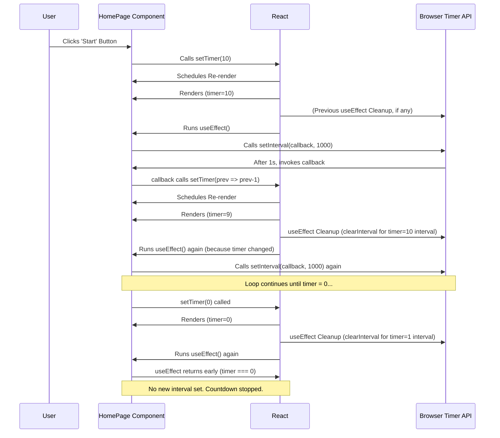

# Chapter 4: Side Effect Management (useEffect)

Welcome back! In [Chapter 3: State Management (useState)](03_state_management__usestate__.md), we learned how to give our component memory using `useState`. We can now start the timer (setting it to 10), reset it, and increment the score, seeing the changes on screen! However, there's still a missing piece: the timer doesn't *automatically* count down. Clicking "start" just sets the display to "10", and it stays there.

Our component knows how to *display* the timer value (`timer` state), but it doesn't know how to change that value *over time* by itself. Rendering the UI and handling clicks are the main job of a component, but sometimes components need to interact with the "outside world" – things beyond just calculating what to display. This could be:

*   Setting timers or intervals (like our countdown!).
*   Fetching data from a server.
*   Manually changing the web page's structure (less common in React).

These interactions are called **Side Effects**.

**Our Goal:** Make the timer automatically decrease by 1 every second after the "start" button is clicked, stopping when it reaches 0.

## Introducing `useEffect`: Handling Actions Over Time

React gives us another special hook called `useEffect` to manage these side effects.

Think of `useEffect` like setting an alarm clock.
1.  You **set the alarm** (you write your `useEffect` code). This usually happens *after* React has updated the screen.
2.  The alarm clock **performs an action** later (it rings, or in our case, it updates the timer state) independently of the main flow of just showing things.
3.  You might also need instructions on **how to turn off the alarm** (cleaning up the effect) so it doesn't run forever.

`useEffect` allows our component to run code that interacts with browser features (like timers) after rendering.

## How to Use `useEffect` for our Timer

Let's add a `useEffect` hook to our `HomePage` component to handle the countdown logic.

**Step 1: Import `useEffect`**

Just like `useState`, we need to import `useEffect` from React.

```javascript
// src/components/HomePage/HomePage.js
import React, { useState, useEffect } from "react"; // <-- Import useEffect
import "./HomePage.css";
```

**Step 2: Call `useEffect`**

Inside your component function (e.g., `HomePage`), you call `useEffect`. It takes two arguments:
1.  A **function** (the "effect" function) containing the side effect code.
2.  An **array of dependencies** (optional, but very important!) which tells React *when* to re-run the effect function.

```javascript
// Inside the HomePage function
function HomePage() {
  const [count, setCount] = useState(0);
  const [timer, setTimer] = useState(0);

  // --- Our Side Effect for the Timer ---
  useEffect(() => {
    // Effect function: This code runs *after* the component renders

    console.log("Effect is running! Timer is:", timer);

    // What should happen here? We need a timer!

  }, [/* dependencies go here */]); // <-- The dependency array

  // ... rest of the component (state, handlers, return JSX) ...
```

**Step 3: Setting Up the Interval**

Inside the effect function, we want to set up something that runs repeatedly. The browser provides a function called `setInterval` for this. `setInterval(callback, delay)` calls the `callback` function every `delay` milliseconds.

```javascript
// Inside the HomePage function
// ... state declarations ...

useEffect(() => {
  // Only start the interval if the timer should be running (> 0)
  if (timer > 0) {
    // Set up an interval timer
    const intervalId = setInterval(() => {
      // This function runs every 1000ms (1 second)
      console.log("Tick!");
      // We need to decrease the timer state here
      setTimer(timer - 1); // <-- PROBLEM: Uses 'timer' from when effect first ran!
    }, 1000); // 1000 milliseconds = 1 second
  }

}, [/* dependencies? */]);

// ... rest of component ...
```

*   `if (timer > 0)`: We only want the countdown to happen if the timer has been started.
*   `setInterval(() => { ... }, 1000)`: This attempts to run the code inside the arrow function every second.
*   `setTimer(timer - 1)`: Inside the interval's callback, we try to update the timer state by decreasing the current `timer` value by 1.

**Uh oh! There's a subtle trap here!** The `timer` variable inside `setInterval`'s callback refers to the value of `timer` *at the time the effect function first ran*. If `timer` was 10 when the effect ran, the callback will *always* call `setTimer(10 - 1)`, setting the timer to 9, over and over again! It doesn't automatically get the *latest* timer value.

Also, what happens if we click "start" again? Or "reset"? We might end up with multiple intervals running simultaneously! We need a way to **clean up**.

**Step 4: Cleaning Up the Effect**

`useEffect` has a built-in mechanism for cleanup. If you return a function from your effect function, React will run that returned function:
*   Before running the effect function again (if dependencies change).
*   When the component is removed from the screen (unmounted).

We need to stop the interval when it's no longer needed. `setInterval` returns an ID that we can use with `clearInterval` to stop it.

```javascript
// Inside the HomePage function
// ... state declarations ...

useEffect(() => {
  if (timer === 0) {
    // If timer hits 0, do nothing (don't start an interval)
    return;
  }

  // Start the interval when timer > 0
  console.log(`Setting up interval when timer is ${timer}`);
  const intervalId = setInterval(() => {
    console.log("Tick! Decrementing timer...");
    // Use functional update form of setTimer for safety
    setTimer(prevTimer => prevTimer - 1);
  }, 1000);

  // --- Cleanup Function ---
  // This function runs when the effect needs to be cleaned up
  return () => {
    console.log(`Cleaning up interval (was for timer value ${timer})`);
    clearInterval(intervalId); // Stop the interval
  };

}, [/* dependencies? */]); // <-- Still need to figure out dependencies!

// ... rest of component ...
```

*   `setTimer(prevTimer => prevTimer - 1)`: This is the **functional update form** of the state setter. Instead of calculating the new state based on `timer` outside, we pass a function to `setTimer`. React gives this function the *most current* state value (`prevTimer`) and we return the new value. This avoids the stale state problem we saw earlier.
*   `return () => { clearInterval(intervalId); };`: We return a cleanup function. When React needs to clean up, it calls this function, which in turn calls `clearInterval` with the ID of the interval we started, effectively stopping the countdown.

**Step 5: The Dependency Array**

Now, the crucial part: the **dependency array**. This array tells `useEffect` which values (props or state) the effect depends on.
*   `useEffect(..., [])`: Empty array. The effect runs **only once** after the initial render, and the cleanup runs only when the component unmounts.
*   `useEffect(..., [value1, value2])`: The effect runs after the initial render, and **any time `value1` or `value2` changes** between renders. The cleanup runs before the effect runs again, and on unmount.
*   `useEffect(...)`: No array (omitted). The effect runs **after every single render**. This is often inefficient and can lead to bugs (like infinite loops if the effect itself causes a re-render).

Which values does our effect depend on?
1.  It reads the `timer` state to decide whether to start the interval (`if (timer === 0)`).
2.  The cleanup function implicitly captures the `intervalId` which is tied to a specific run of the effect, linked to the `timer` value *at that time*.

So, our effect should re-run whenever the `timer` state changes. This ensures:
*   If `timer` becomes 0, the effect runs, hits the `if (timer === 0)` condition, and does nothing (correct).
*   If `timer` changes from 0 to 10 (when "start" is clicked), the *old* effect (if any) is cleaned up, and the *new* effect runs, setting up the interval.
*   If `timer` changes from, say, 5 to 0 (when "reset" is clicked *or* the countdown finishes), the cleanup function for the *old* effect (associated with timer=5) runs, clearing the interval. The new effect (for timer=0) runs and does nothing.

Therefore, `timer` needs to be in the dependency array.

```javascript
// Final useEffect for the timer

useEffect(() => {
  if (timer === 0) return; // Stop condition

  // Setup: Runs when timer changes and is > 0
  const intervalId = setInterval(() => {
    setTimer(prevTimer => prevTimer - 1);
  }, 1000);

  // Cleanup: Runs before the next effect runs OR when component unmounts
  return () => {
    clearInterval(intervalId);
  };
}, [timer]); // <-- Dependency: Re-run effect if 'timer' changes
```

## Putting It Together (`HomePage.js` focus on timer logic)

```javascript
// src/components/HomePage/HomePage.js
import React, { useState, useEffect } from "react"; // Import both hooks
import "./HomePage.css";

function HomePage() {
  const [count, setCount] = useState(0);
  const [timer, setTimer] = useState(0); // Timer state starts at 0

  // --- Effect to Handle Countdown ---
  useEffect(() => {
    // Don't start interval if timer is already 0
    if (timer === 0) {
      return;
    }

    // Set up the interval to decrease timer every second
    const intervalId = setInterval(() => {
      setTimer((prevTimer) => prevTimer - 1); // Use functional update
    }, 1000);

    // Cleanup function: Clear interval when effect re-runs or component unmounts
    return () => {
      clearInterval(intervalId);
    };
  }, [timer]); // Dependency array: run effect when 'timer' changes

  // --- Event Handlers ---
  const handleStartClick = () => {
    setTimer(10); // Set timer to 10 seconds
    setCount(0);  // Reset count
  };

  const handleIncrementClick = () => {
    // Only increment if timer is running
    if (timer > 0) {
      setCount((prevCount) => prevCount + 1);
    }
  };

  const handleResetClick = () => {
    setTimer(0);  // Reset timer
    setCount(0); // Reset count
  };

  // --- JSX ---
  return (
    <div className="home-container">
      <div className="home-timer">timer:{timer}</div>
      <div className="home-count">{count}</div>
      <button
        className="home-btn-start btn"
        onClick={handleStartClick}
        disabled={timer !== 0} // Disable start if timer is running
      >
        start
      </button>
      <button
        className="home-btn-click btn"
        onClick={handleIncrementClick}
        disabled={timer === 0} // Disable click if timer is not running
      >
        click me
      </button>
      <button className="home-btn-reset btn" onClick={handleResetClick}>
        reset
      </button>
    </div>
  );
}

export default HomePage;

```

Now, when you click "start":
1.  `timer` becomes 10.
2.  React re-renders `HomePage`.
3.  The previous `useEffect` cleanup (if any) runs.
4.  The `useEffect` function runs because `timer` changed.
5.  Since `timer` is 10 (not 0), `setInterval` is called.
6.  Every 1 second, the interval callback calls `setTimer(prevTimer => prevTimer - 1)`.
7.  Each `setTimer` call updates the state, causing a re-render, displaying the new timer value.
8.  When `timer` eventually becomes 0:
    *   React re-renders.
    *   The cleanup function for the *last* interval (when timer was 1) runs, calling `clearInterval`.
    *   The `useEffect` function runs again because `timer` changed (to 0).
    *   It hits the `if (timer === 0)` condition and returns early, not starting a new interval. The countdown stops!

## Under the Hood: React Coordinating Effects

React manages effects carefully alongside rendering and state updates.

1.  **Trigger:** An event happens (e.g., "start" click) that calls a state setter (`setTimer(10)`).
2.  **Re-render:** React schedules a re-render of the component (`HomePage`).
3.  **Render:** React calls the `HomePage` function. It gets the new state (`timer` is 10).
4.  **Update Screen:** React updates the parts of the screen (DOM) that changed.
5.  **Cleanup Effect:** *After* the screen update, React checks the `useEffect` dependency array (`[timer]`). Since `timer` changed, it runs the cleanup function from the *previous* run of the effect (if there was one).
6.  **Run Effect:** React then runs the `useEffect` function itself. In our case, it sets up the `setInterval`.
7.  **Interval Ticks:** The browser's timer mechanism calls the `setInterval` callback every second.
8.  **State Update from Interval:** The callback calls `setTimer(prev => prev - 1)`.
9.  **Cycle Repeats:** This triggers another re-render (Step 2), screen update (Step 4), effect cleanup (Step 5 - clearing the *old* interval), and effect run (Step 6 - setting up a *new* interval, though the callback logic is the same).
10. **Stop Condition:** When `timer` becomes 0, the effect runs (Step 6), hits the `if (timer === 0)` check, and returns early, *not* setting up a new interval. The cleanup (Step 5) already cleared the last active interval.



## Conclusion

You've now mastered another essential React hook: `useEffect`!

*   **Side Effects:** Actions that interact with the outside world (timers, data fetching, etc.).
*   **`useEffect` Hook:** Lets you perform side effects *after* rendering.
*   **Structure:** `useEffect(effectFunction, dependencyArray)`.
*   **Effect Function:** Contains the code for your side effect (e.g., `setInterval`).
*   **Cleanup Function:** Returned by the effect function, cleans up resources (e.g., `clearInterval`). Runs before the next effect or on unmount.
*   **Dependency Array:** Controls when the effect runs and cleans up. Essential for correctness and performance.

We now have a fully functional core for our Counter Game! The timer counts down, the score updates, and the buttons enable/disable appropriately.

But how does this `HomePage` component actually get displayed in the browser? It needs to be part of a larger application structure. In the next chapter, we'll look at the main component that holds our `HomePage`.

Ready to see the bigger picture? Let's examine the [Chapter 5: Root Component (App)](05_root_component__app__.md).

---

Generated by [AI Codebase Knowledge Builder](https://github.com/The-Pocket/Tutorial-Codebase-Knowledge)