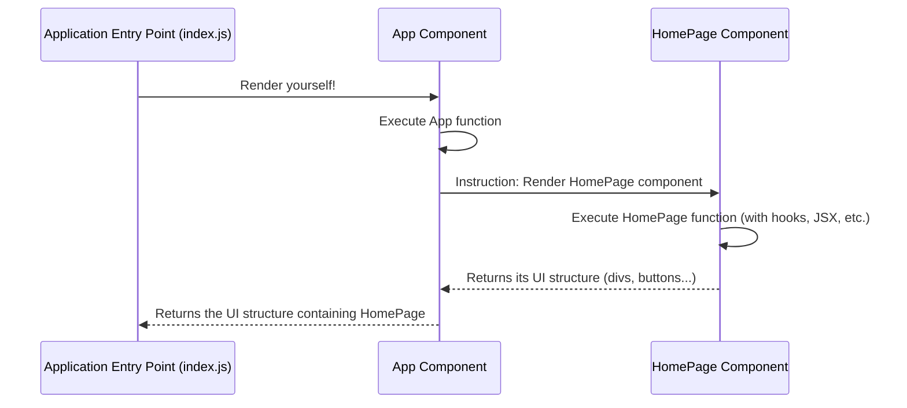

# Chapter 5: Root Component (App)

Welcome back! In [Chapter 4: Side Effect Management (useEffect)](04_side_effect_management__useeffect__.md), we successfully added the countdown logic to our `HomePage` component using the `useEffect` hook. Our game now has a working timer, score counter, and interactive buttons. The `HomePage` component holds all the game's visuals and logic together.

But how does this `HomePage` component actually get shown on the web page? It can't just appear out of thin air! Just like in a theater, where individual scenes need a main stage to be performed on, our `HomePage` component needs a place to be displayed within the overall application structure.

**Our Goal:** Understand the role of the main container component, typically called `App`, which acts as the entry point for our UI components.

## Meet the `App` Component: The Main Stage

In most React applications, there's a top-level component that acts as the main container for everything else the user sees. By convention, this is often called the `App` component.

Think of it like the main stage in a theater:
*   The stage itself (`App` component) doesn't change much.
*   It's the place where different scenes (`HomePage` component, or other components in larger apps) are presented to the audience.

In our simple Counter Game, the `App` component's primary job is extremely straightforward: it needs to display our `HomePage` component.

**File:** `src/App.js`

Let's look at the code for our `App` component. It's surprisingly simple!

```javascript
// src/App.js

// 1. Import the component we want to display
import HomePage from "./components/HomePage/HomePage";

// 2. Define the App component function
function App() {
  // 3. Return the component(s) to be rendered
  return <HomePage />;
}

// 4. Make the App component available for use
export default App;
```

**Explanation:**

1.  `import HomePage from "./components/HomePage/HomePage";`: Just like we imported React hooks (`useState`, `useEffect`) before, here we import the `HomePage` component we built in the previous chapters. We need to tell `App.js` where to find the `HomePage` code.
2.  `function App() { ... }`: This defines our `App` component. It's a standard JavaScript function, just like `HomePage`.
3.  `return <HomePage />;`: This is the core! Inside the `return` statement, we use JSX to tell React what `App` should render. `<HomePage />` instructs React to render our entire `HomePage` component right here. If our app had multiple pages or sections (like a navigation bar and a main content area), we would structure them here. For our simple game, we just need the `HomePage`.
4.  `export default App;`: This line makes the `App` component available so that another file (the main entry point of our application) can import and use it.

That's it! The `App` component acts as a simple wrapper or container whose only job, in this project, is to put the `HomePage` component onto the "stage".

## Why Have a Separate `App` Component?

You might wonder, "If `App` just shows `HomePage`, why not skip `App` altogether?"

That's a good question! In very tiny examples, you might see that. However, having a root `App` component is standard practice for several reasons:

*   **Organization:** It provides a clear top-level entry point for your UI structure.
*   **Scalability:** As applications grow, the `App` component often becomes responsible for more complex tasks like:
    *   Setting up page layouts (headers, footers, sidebars).
    *   Handling routing (deciding which page component to show based on the URL).
    *   Providing global context or data to all other components.
*   **Consistency:** It follows a common pattern seen in most React projects, making it easier for developers to understand the structure.

Even though our `App` component is simple now, using it sets up a good foundation.

## Under the Hood: How `App` Renders `HomePage`

The `App` component doesn't render itself directly to the browser either. There's one final piece of the puzzle: the code that tells React, "Okay, start the whole process by rendering the `App` component into the actual web page." We'll cover that in the next chapter about the [Application Entry Point](06_application_entry_point_.md).

For now, let's visualize the relationship between `App` and `HomePage`:



1.  Something (the Application Entry Point) tells the `App` component to render.
2.  The `App` function runs.
3.  Its `return` statement says `<HomePage />`.
4.  React then says, "Okay, now I need to render the `HomePage` component."
5.  The `HomePage` function runs, calculates its state, sets up effects, and returns its own JSX structure (the timer, counter, buttons).
6.  This structure is effectively placed inside the `App` component's output.

## Conclusion

You've now learned about the role of the **Root Component**, typically named `App`.

*   It acts as the main container or "stage" for your application's UI.
*   In simple apps like ours, its main job might be to render a single primary component (like `HomePage`).
*   It provides structure and is essential for organizing and scaling React applications.
*   It uses standard component syntax (`function App() { ... }`, `import`, `export`, `return <JSX />`).

We've seen how `HomePage` displays the game elements, and how `App` displays `HomePage`. But what kicks off this whole rendering chain? How does `App` get told to render in the first place?

Let's find out in the final chapter!

Ready to see how the application starts? Let's explore the [Chapter 6: Application Entry Point](06_application_entry_point_.md).

---

Generated by [AI Codebase Knowledge Builder](https://github.com/The-Pocket/Tutorial-Codebase-Knowledge)