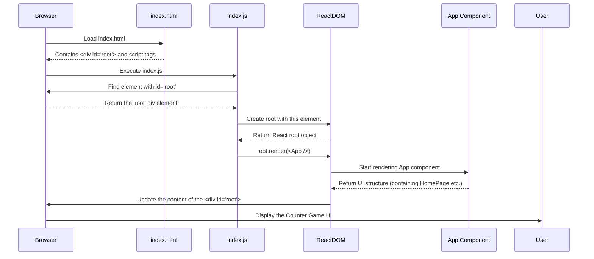

# Chapter 6: Application Entry Point

Welcome to the final chapter! In [Chapter 5: Root Component (App)](05_root_component__app__.md), we saw how the `App` component acts as the main stage, holding our `HomePage` component. We have all the pieces: the game logic in `HomePage`, and `App` presenting it. But how does the whole show start? When you open the game in your browser, what's the very first spark that brings `App` (and therefore `HomePage`) to life on the screen?

Think about starting a car. You have the engine (`HomePage`), the chassis and body (`App`), but nothing happens until you turn the key in the ignition. We need that "ignition switch" for our React application – the very first piece of code that runs to kick everything off. This is the **Application Entry Point**.

**Our Goal:** Understand the files and code responsible for starting the React application and rendering our main `App` component into the web page.

## Where Does It All Begin? The HTML and the Root

Before any React code runs, your web browser first loads a plain HTML file. In most React projects created with tools like Create React App, this file is located at `public/index.html`.

**File:** `public/index.html` (Simplified)

```html
<!DOCTYPE html>
<html lang="en">
  <head>
    <!-- Metadata, links to CSS, etc. -->
    <title>Counter Game</title>
  </head>
  <body>
    <noscript>You need to enable JavaScript to run this app.</noscript>

    <!-- This div is the target! -->
    <div id="root"></div>

    <!-- The browser will load and run JavaScript files, including our React code -->
  </body>
</html>
```

**Explanation:**

*   This is a standard HTML file. The browser understands how to read this.
*   The most important part for us is `<div id="root"></div>`. This is an empty container element. Think of it as an empty picture frame hanging on the wall. It doesn't contain anything *yet*.
*   React needs a specific place in the HTML to inject the user interface it builds. This `div` with the unique ID `root` serves as that target location. Our entire Counter Game application will be rendered *inside* this specific `div`.

## The JavaScript Ignition: `src/index.js`

Okay, the browser loads the HTML and sees the empty `<div id="root"></div>`. Now what?

Usually, the HTML file also includes instructions to load JavaScript files. One of these files acts as the main entry point for our React code. By convention, this file is `src/index.js`. This file is where the magic happens – where we tell React to take control of that empty `div`.

**File:** `src/index.js`

```javascript
// 1. Import necessary tools
import React from "react";
import ReactDOM from "react-dom/client"; // Tool for connecting React to the HTML page
import App from "./App"; // Our main App component!
import "./index.css"; // Global styles for the app

// 2. Find the HTML container element
const rootElement = document.getElementById("root");

// 3. Create a React "root" for that container
const root = ReactDOM.createRoot(rootElement);

// 4. Tell React to render our App component into the root
root.render(
  <React.StrictMode>
    <App />
  </React.StrictMode>
);
```

**Explanation Step-by-Step:**

1.  **Imports:**
    *   `React`: We always need this when writing React code.
    *   `ReactDOM`: This is a specific library for using React with web browsers (the "DOM" - Document Object Model - is how browsers represent HTML structure). `ReactDOM` provides the tools to connect our React components to the actual HTML page.
    *   `App`: We import our top-level [Root Component (App)](05_root_component__app__.md). This is the component we want to render first.
    *   `./index.css`: Imports some basic styling for the entire application.

2.  **Find the Target:**
    *   `const rootElement = document.getElementById("root");`
    *   This is standard browser JavaScript! It searches the loaded HTML page (`public/index.html`) for an element that has the ID `root`. It finds our empty `<div>`.

3.  **Create React Root:**
    *   `const root = ReactDOM.createRoot(rootElement);`
    *   We use the `createRoot` function from `ReactDOM`. Think of this as preparing the empty HTML `div` (`rootElement`) to be managed by React. It sets up the necessary connections.

4.  **Render the App:**
    *   `root.render(<App />);` (Ignoring `React.StrictMode` for a moment)
    *   This is the command: "React, please take the `<App />` component and render its output *inside* the `rootElement` we found earlier."
    *   `<React.StrictMode>`: This is a helper component provided by React. It doesn't render anything visible but activates additional checks and warnings during development to help catch potential problems in your code. It's good practice to wrap your `App` in it.

And that's it! This `index.js` file acts as the bridge between the static HTML file and our dynamic React application components. It finds the designated spot in the HTML and tells React to start rendering our `App` component there.

## Under the Hood: The Startup Sequence

Let's visualize the startup process:

1.  **Browser:** Loads `public/index.html`.
2.  **Browser:** Sees the `<div id="root"></div>` and instructions to load JavaScript (including `src/index.js`).
3.  **Browser:** Executes `src/index.js`.
4.  **`index.js`:** Finds the `<div id="root">` using `document.getElementById('root')`.
5.  **`index.js`:** Tells `ReactDOM` to create a root connected to that `div`.
6.  **`index.js`:** Calls `root.render(<App />)`.
7.  **React:** Starts rendering the `App` component ([Chapter 5: Root Component (App)](05_root_component__app__.md)).
8.  **React:** `App` renders `HomePage` ([Chapter 1: Game UI Component (HomePage)](01_game_ui_component__homepage__.md)), which uses state ([Chapter 3: State Management (useState)](03_state_management__usestate__.md)) and effects ([Chapter 4: Side Effect Management (useEffect)](04_side_effect_management__useeffect__.md)) and handles clicks ([Chapter 2: Event Handling (onClick)](02_event_handling__onclick__.md)).
9.  **React/ReactDOM:** Takes the final UI structure generated by the components and updates the actual `<div id="root">` in the browser's display. The user sees the Counter Game!



## Conclusion

Congratulations! You've reached the end of our core concepts journey for the Counter Game. You now understand the critical role of the **Application Entry Point**:

*   It starts with a basic **HTML file** (`public/index.html`) containing a placeholder element (like `<div id="root">`).
*   A **JavaScript file** (`src/index.js`) acts as the initial script to run.
*   This script uses **`ReactDOM`** to find the HTML placeholder and tell React to render the main **`App` component** into it.
*   This process connects our React component tree to the actual web page the user sees.

You've gone from building a simple UI component (`HomePage`), handling clicks (`onClick`), managing state (`useState`), dealing with side effects like timers (`useEffect`), structuring the app with a root component (`App`), and finally seeing how the entire application is launched by the entry point (`index.js`).

You now have a solid foundation in the key concepts used in many React applications! From here, you can explore more advanced topics, build more complex games, or dive deeper into styling, testing, and other aspects of web development. Well done!

---

Generated by [AI Codebase Knowledge Builder](https://github.com/The-Pocket/Tutorial-Codebase-Knowledge)