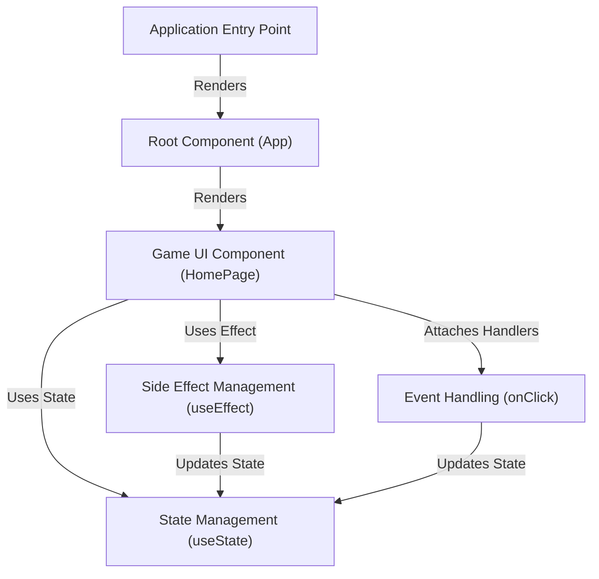

# Tutorial: counter-game

This project is a simple **React** web application called the *Counter Game*.
It displays a **timer** and a **counter**. When the user clicks *'start'*, a 10-second timer begins.
While the timer is active, the user can click the *'click me'* button to increment the counter.
The game uses React's built-in features like **state** (`useState`) to keep track of the count and timer values, **side effects** (`useEffect`) to manage the timer's countdown logic, and **event handlers** (`onClick`) to respond when buttons are pressed.

**Source Repository:** [None](None)

## Chapters

1. [Game UI Component (HomePage)
](01_game_ui_component__homepage__.md)
2. [Event Handling (onClick)
](02_event_handling__onclick__.md)
3. [State Management (useState)
](03_state_management__usestate__.md)
4. [Side Effect Management (useEffect)
](04_side_effect_management__useeffect__.md)
5. [Root Component (App)
](05_root_component__app__.md)
6. [Application Entry Point
](06_application_entry_point_.md)

---

Generated by [AI Codebase Knowledge Builder](https://github.com/The-Pocket/Tutorial-Codebase-Knowledge)